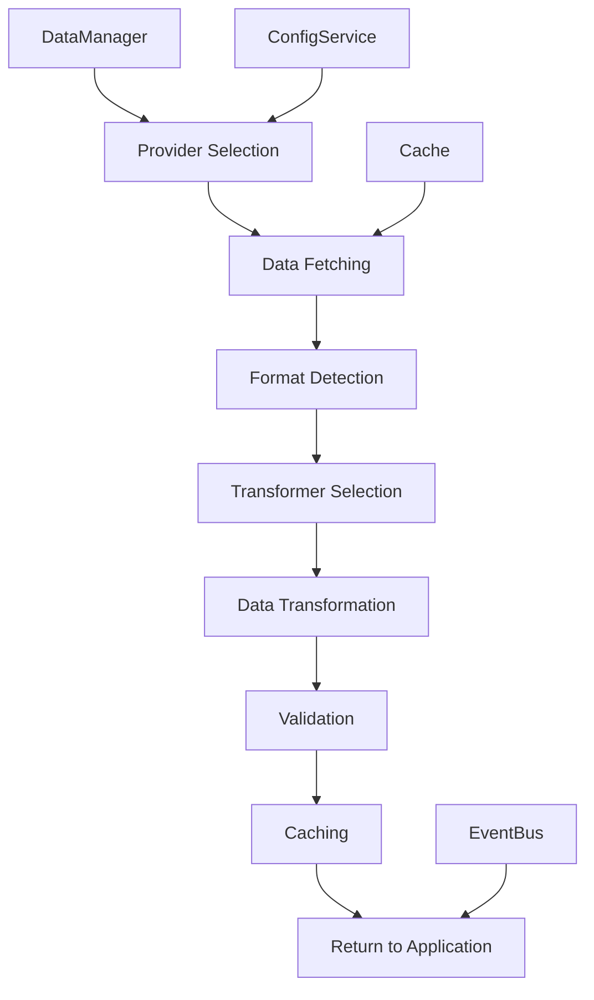

# Symphony Dashboard - Modular Architecture Documentation

## 🎯 **Overview**

The Symphony Dashboard has been completely refactored into a modular, scalable framework that separates concerns and provides clear interfaces between components. This documentation serves as your guide to understanding, extending, and maintaining the modular codebase.

---

## 🏗️ **Architecture Layers**

### **🧱 Core Layer**
The foundation that everything else builds upon.

#### **SymphonyFramework** (`src/core/framework.js`)
**Purpose**: Application orchestration and module lifecycle management
**Responsibilities**:
- Module registration and dependency injection
- Lifecycle management (init, start, stop, destroy)
- Service registry and lookup
- Inter-module communication via EventBus

**Key Methods**:
```javascript
// Register a module
framework.registerModule('dataManager', DataManager, config);

// Get a service
const dataManager = framework.getService('dataManager');

// Lifecycle management
await framework.init();
await framework.start();
```

#### **SymphonyEventBus** (`src/core/framework.js`)
**Purpose**: Decoupled communication between modules
**Responsibilities**:
- Event subscription and publishing
- Event filtering and routing
- Prevents direct module dependencies

**Usage**:
```javascript
// Subscribe to events
eventBus.on('data:loaded', (data) => { /* handle */ });

// Publish events
eventBus.emit('data:loaded', { type: 'performances', count: 100 });
```

#### **SymphonyRegistry** (`src/core/framework.js`)
**Purpose**: Service and component discovery
**Responsibilities**:
- Find services by capability
- Module discovery and introspection

---

### **⚙️ Service Layer**
Core services that provide fundamental functionality.

#### **ConfigService** (`src/services/config-service.js`)
**Purpose**: Centralized configuration management
**Responsibilities**:
- Environment-specific configuration
- Runtime configuration updates
- Configuration validation and persistence

**Interface**:
```javascript
// Get configuration
const colors = configService.get('charts.colors');
const apiUrl = configService.get('api.tessitura.baseUrl');

// Set configuration
configService.set('charts.colors.primary', '#667eea', true); // persist = true

// Watch for changes
const unwatch = configService.watch('charts.colors', (newColors) => {
    // Handle color changes
});
```

**Configuration Structure**:
```javascript
{
    app: { name, version, description },
    framework: { logging, modules, events },
    charts: { colors, dimensions, animation },
    data: { sources, cache, validation },
    api: { tessitura, dashboard },
    ui: { theme, responsive, animations }
}
```

---

### **📊 Data Layer**
Handles all data operations with provider abstraction.

#### **DataManager** (`src/data/data-manager.js`)
**Purpose**: Orchestrates data operations across providers and transformers
**Responsibilities**:
- Provider management and fallback logic
- Data transformation coordination
- Caching and performance optimization
- Data validation

**Interface**:
```javascript
// Get performance data
const performances = await dataManager.getPerformances({
    startDate: '2025-01-01',
    series: 'CS01'
});

// Get sales data for specific performance
const sales = await dataManager.getSalesData('perf-123');

// Refresh all data
await dataManager.refreshData();
```

#### **Data Providers** (`src/data/providers/`)
**Purpose**: Abstract data source access
**Standard Interface**:
```javascript
class DataProvider extends SymphonyModule {
    async connect() { /* Establish connection */ }
    async fetch(dataType, options) { /* Fetch data */ }
    getCapabilities() { /* Return supported data types */ }
    async testConnection() { /* Test connectivity */ }
}
```

**Available Providers**:
- **CSVDataProvider**: Loads data from JSON/CSV files
- **TessituraProvider**: (Future) Direct Tessitura API integration
- **MockDataProvider**: (Future) Development/testing data

#### **Data Transformers** (`src/data/transformers/`)
**Purpose**: Convert between data formats
**Standard Interface**:
```javascript
class DataTransformer extends SymphonyModule {
    async transform(data) { /* Transform data */ }
    validate(data) { /* Validate input format */ }
    getInfo() { /* Return transformer metadata */ }
}
```

**Available Transformers**:
- **KCSTransformer**: KCS CSV format → Dashboard format
- **TessituraTransformer**: (Future) Tessitura API → Dashboard format

---

### **🎨 Visualization Layer**
Standardized chart creation and management.

#### **ChartFramework** (`src/charts/chart-framework.js`)
**Purpose**: Chart type registration and instance management
**Responsibilities**:
- Chart type registry
- Chart instance creation and lifecycle
- Configuration merging
- Chart capability matching

**Interface**:
```javascript
// Register chart type
chartFramework.registerChartType('performance-chart', PerformanceChart, {
    description: 'Performance overview visualization',
    dataTypes: ['numeric', 'categorical'],
    capabilities: ['responsive', 'interactive']
});

// Create chart instance
const chart = chartFramework.createChart('performance-chart', '#chart-container', {
    colors: { primary: '#667eea' },
    showLegend: true
});

// Render data
await chart.render(performanceData);
```

#### **BaseChart** (`src/charts/chart-framework.js`)
**Purpose**: Standard chart interface and common functionality
**Standard Interface**:
```javascript
class CustomChart extends BaseChart {
    async renderChart(data) { /* Implement visualization */ }
    async updateChart(data) { /* Update with new data */ }
    resizeChart() { /* Handle container resize */ }
}
```

**Lifecycle Events**:
- `chart:initialized` - Chart setup complete
- `chart:rendered` - Data visualization complete
- `chart:updated` - Data update complete
- `chart:resized` - Chart resized
- `chart:destroyed` - Chart cleanup complete

---

### **🖥️ UI Layer**
User interface components and interactions.

#### **Component Structure**:
```
src/ui/
├── layout/
│   ├── dashboard-layout.js     # Main dashboard structure
│   └── responsive-layout.js    # Responsive behavior
├── controls/
│   ├── filter-controls.js      # Data filtering UI
│   ├── export-controls.js      # Export functionality
│   └── nav-controls.js         # Navigation components
└── modals/
    ├── performance-modal.js    # Performance detail popups
    └── chart-modal.js          # Chart expansion modals
```

---

## 🔗 **Module Communication Patterns**

### **Service Injection**
Modules access services through the framework:
```javascript
class MyModule extends SymphonyModule {
    async doSomething() {
        const configService = this.getService('configService');
        const dataManager = this.getService('dataManager');

        const apiUrl = configService.get('api.baseUrl');
        const data = await dataManager.getPerformances();
    }
}
```

### **Event-Based Communication**
Modules communicate without direct dependencies:
```javascript
// Module A publishes data
this.emit('data:loaded', { performances: data });

// Module B subscribes to updates
this.on('data:loaded', (event) => {
    this.updateCharts(event.performances);
});
```

### **Registry Discovery**
Find modules by capability:
```javascript
const chartModules = registry.findModules('chart');
const exporters = registry.findServices('export');
```

---

## 🛠️ **Development Workflows**

### **Adding a New Chart Type**

1. **Create Chart Class**:
```javascript
// src/charts/components/my-chart.js
class MyChart extends BaseChart {
    async renderChart(data) {
        // D3.js visualization code
        this.svg.selectAll('.bar')
            .data(data)
            .enter()
            .append('rect')
            .attr('class', 'bar')
            // ... chart implementation
    }

    async updateChart(data) {
        // Update existing visualization
    }

    resizeChart() {
        // Handle resize
    }
}

// Register with framework
window.MyChart = MyChart;
```

2. **Register Chart Type**:
```javascript
// In application startup or chart module
chartFramework.registerChartType('my-chart', MyChart, {
    description: 'Custom visualization',
    dataTypes: ['numeric'],
    capabilities: ['interactive', 'exportable']
});
```

3. **Use Chart**:
```javascript
const chart = symphonyApp.createChart('my-chart', '#container', {
    colors: { primary: '#ff6b6b' }
});
await chart.render(data);
```

### **Adding a New Data Provider**

1. **Create Provider Class**:
```javascript
// src/data/providers/my-provider.js
class MyDataProvider extends SymphonyModule {
    async init(config) {
        await super.init(config);
        this.emit('provider:available', {
            name: 'my-provider',
            provider: this
        });
    }

    async fetch(dataType, options) {
        // Implement data fetching
        switch (dataType) {
            case 'performances':
                return this.fetchPerformances(options);
            default:
                throw new Error(`Unsupported data type: ${dataType}`);
        }
    }

    getCapabilities() {
        return ['performances', 'sales'];
    }
}
```

2. **Register Provider**:
```javascript
// In application startup
framework.registerModule('myProvider', MyDataProvider, {
    apiUrl: 'https://api.example.com',
    apiKey: 'secret'
});
```

### **Adding a New Service**

1. **Create Service Class**:
```javascript
// src/services/my-service.js
class MyService extends SymphonyModule {
    constructor(framework) {
        super(framework);
        this.dependencies = ['configService']; // Declare dependencies
    }

    async init(config) {
        await super.init(config);

        // Service implementation
        this.doSomething = () => {
            const config = this.getService('configService');
            // Service logic
        };
    }
}
```

2. **Register Service**:
```javascript
framework.registerModule('myService', MyService, config);
```

---

## 🔧 **Configuration Management**

### **Environment-Specific Config**
The system automatically loads configuration based on environment:

- **Development**: `localhost` → debug logging, short cache TTL
- **Testing**: `*.test.*` → error-only logging, mock data
- **Production**: Everything else → warn logging, long cache TTL

### **Configuration Hierarchy**
1. **Default Config**: Built-in defaults
2. **Environment Config**: Environment-specific overrides
3. **Local Config**: localStorage overrides
4. **Runtime Config**: URL parameter overrides

### **Runtime Configuration**
```javascript
// URL parameters automatically apply
// http://localhost:8888?debug=true&theme=dark&mock=true

// Programmatic updates
symphonyApp.setConfig('charts.colors.primary', '#ff6b6b', true);

// Watch for changes
configService.watch('charts.colors', (newColors) => {
    // Update all charts with new colors
});
```

---

## 📊 **Data Flow Architecture**



### **Provider Fallback Chain**
1. Try primary provider (e.g., Tessitura API)
2. On failure, try fallback provider (e.g., CSV files)
3. If all fail, throw error

### **Transformation Pipeline**
1. Detect data format (KCS CSV, Tessitura API, etc.)
2. Select appropriate transformer
3. Transform to standard dashboard format
4. Validate transformed data
5. Cache result

---

## 🚀 **Application Lifecycle**

### **Startup Sequence**
1. **Framework Initialization**
   - Create EventBus and Registry
   - Setup error handling
   - Initialize logging

2. **Service Registration**
   - ConfigService (loads configuration)
   - DataManager (registers providers/transformers)
   - ChartFramework (prepares chart system)

3. **Module Loading**
   - Resolve dependencies
   - Initialize modules in dependency order
   - Start all modules

4. **Application Ready**
   - UI initialization
   - Data loading
   - Chart rendering

### **Shutdown Sequence**
1. Stop all modules (reverse order)
2. Destroy module instances
3. Clear registrations
4. Cleanup resources

---

## 🐛 **Debugging and Development**

### **Development Console Commands**
When in development mode, debugging helpers are available:

```javascript
// Application statistics
debug.stats()

// Configuration management
debug.config('charts.colors.primary')  // Get
debug.config('charts.colors.primary', '#ff0000')  // Set

// Data operations
debug.refresh()  // Refresh all data

// Application control
debug.restart()  // Stop and restart app
```

### **Logging Levels**
- **debug**: Detailed information for development
- **info**: General information about application flow
- **warn**: Warning conditions
- **error**: Error conditions that need attention

### **Event Monitoring**
```javascript
// Monitor all framework events
symphonyFramework.getService('eventBus').on('*', (event, data) => {
    console.log('Event:', event, data);
});
```

---

## 📈 **Performance Optimization**

### **Caching Strategy**
- **Performance Data**: 30-minute TTL
- **Sales Data**: 5-minute TTL (more dynamic)
- **Configuration**: In-memory (persistent)
- **Chart Instances**: Lifecycle-managed

### **Memory Management**
- Charts automatically cleanup on destroy
- Event listeners are properly removed
- Cache has size limits and automatic cleanup

### **Bundle Optimization**
- Modules load on-demand
- Charts register themselves when available
- Services lazy-load dependencies

---

## 🔐 **Security Considerations**

### **Configuration Security**
- API credentials never exposed to frontend
- Configuration validation prevents injection
- Local storage is sanitized

### **Data Validation**
- All external data is validated
- Transformers include input validation
- SQL injection prevention (if applicable)

---

## 🧪 **Testing Strategy**

### **Unit Testing**
- Each module is independently testable
- Mock services for isolation
- Configuration injection for test scenarios

### **Integration Testing**
- Framework lifecycle testing
- Service interaction testing
- Data flow validation

### **End-to-End Testing**
- Complete application workflows
- Chart rendering validation
- Data accuracy verification

---

## 📚 **API Reference**

### **SymphonyApp Public API**
```javascript
const app = window.symphonyApp;

// Data operations
await app.getPerformances(options)
await app.getSalesData(performanceId, options)
await app.refreshData()

// Chart operations
app.createChart(type, container, config)

// Configuration
app.getConfig(path, defaultValue)
app.setConfig(path, value, persist)

// Application info
app.getStats()
```

### **Module Development API**
```javascript
class MyModule extends SymphonyModule {
    // Lifecycle
    async init(config) { }
    async start() { }
    async stop() { }
    async destroy() { }

    // Service access
    this.getService(name)
    this.getModule(name)

    // Events
    this.emit(event, data)
    this.on(event, handler)
    this.off(event, handler)

    // Logging
    this.log(level, message, ...args)
}
```

---

## 🎯 **Best Practices**

### **Module Development**
1. **Single Responsibility**: Each module should have one clear purpose
2. **Dependency Declaration**: Always declare dependencies explicitly
3. **Error Handling**: Wrap async operations in try-catch
4. **Event Naming**: Use namespaced events (`module:action`)
5. **Configuration**: Use ConfigService for all settings

### **Chart Development**
1. **Extend BaseChart**: Always extend the base class
2. **Responsive Design**: Handle container resize properly
3. **Accessibility**: Include ARIA labels and keyboard navigation
4. **Performance**: Use D3 enter/update/exit pattern
5. **Events**: Emit lifecycle events for debugging

### **Data Handling**
1. **Validation**: Always validate external data
2. **Transformation**: Keep transformers pure and testable
3. **Caching**: Use appropriate TTL for data type
4. **Error Recovery**: Implement fallback strategies
5. **Performance**: Use pagination for large datasets

---

This modular architecture provides a solid foundation for scaling the Symphony Dashboard while maintaining code quality, testability, and developer productivity. Each component has clear responsibilities and well-defined interfaces, making it easy to understand, extend, and maintain the codebase as it grows.